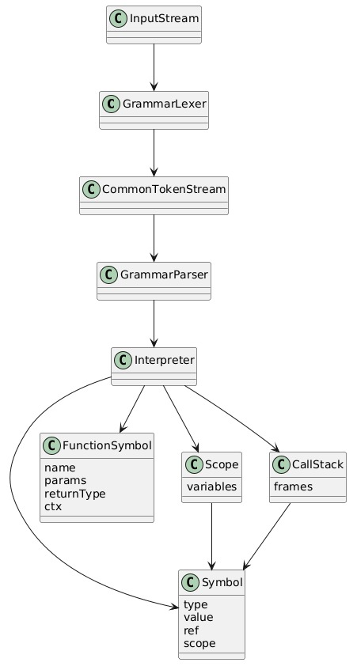
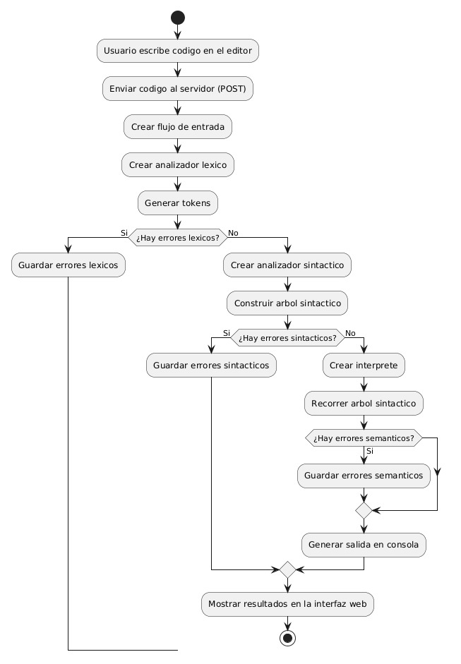

# GRAMATICA GOLAMPI

## SIMBOLO INICIAL

< programa >  : : =   < toplevel >* EOF

## ESTRUCTURA DEL PROGRAMA

< toplevel > : : = < funcion >  
            | < mainFuncion >  
            | < declaracion >  
            | < declaracionConst >

## FUNCION PRINCIPAL

< mainFuncion > : : = "func"  "main"  "("  ")"  < bloque >

## INSTRUCCIONES

< i > : : =  < imprimir >  
            | < declaracion >  
            | < declaracionCorta >  
            | < declaracionConst >  
            | < asignacion >  
            | < sentenciaIf >  
            | < sentenciaSwitch >  
            | < sentenciaFor >  
            | < expFor >  
            | < funcion >  
            | < llamadaFuncion >  
            | < retornar >  
            | < logExpr >  
            | " continue "  
            | " break "  

## INSTRUCCION IMPRIMIR (funcion embebida)

< imprimir > : : = "fmt" "." "Println" "(" < listaExpr > ")"

## DECLARACION

< declaracion > : : = "var" < listaId > tipos  
| "var" < listaId > tipos "=" < listaExpr >

## DECLARACION CORTA

< declaracionCorta > : : = < listaId > ":" "=" < listaExpr >

## DECLARACION CONSTANTE

< declaracionConst > : : = "const" < IDENTIFICADOR > < tipos > " = " < logExpr >

## ASIGNACION

< asignacion > : : = < IDENTIFICADOR > < simboloAsignacion > < logExpr >  
| < accesoArreglo > < simboloAsignacion > < logExpr >  

## SENTENCIAS

### SENTENCIA IF:

< sentenciaIf > : : = "if" < logExpr > < bloque >  ( "else" < bloque > )?

### SENTENCIA SWITCH:

< sentenciaSwitch > : : = "switch" < logExpr > "{" < bloqueSwitch > "}"

< bloqueSwitch > : : = (< bloqueCase >)+ (< bloqueDefault >)?

< bloqueCase > : : = "case" < listaExpr > ":" (< i >)*

< bloqueDefault > : : = "default" ":" (< i >)*

### SENTENCIA FOR:

< sentenciaFor > : : = "for" < forClasico >  
| "for" < logExpr > < bloque >  
| "for" < bloque >

< forclasico > : : = < declaracionCorta > ";" < logExpr > ";" < condFor > < bloque >

< condFor > : : = < expFor >  
| < asignacion >

#### AUTOINCREMENTO Y AUTODECREMENTO:

< expFor > : : = < IDENTIFICADOR > " + " " + "  
| < IDENTIFICADOR > " - " " - S" 

## MANEJO DE FUNCIONES

### DECLARACION FUNCION:

< funcion > : : = "func" < IDENTIFICADOR > "(" < listaParametros >?  ")" (" < listaRetorno >?  ")" < bloque >  
| "func" < IDENTIFICADOR > "(" < listaParametros >?  ")" < tipos > < bloques >  
| "func" < IDENTIFICADOR > "(" < listaParametros >?  ")" < bloques >

< listaRetorno > : : =  < tipos > ("," < tipos >)*

< listaParametros > : : = < parametro > ("," < parametro >)*

< parametro > : : = < IDENTIFICADOR > " * "? < tipos >

### LLAMADA FUNCION

< llamadaFuncion > : : = < IDENTIFICADOR > "(" < listaExpr >? ")"

### RETORNAR

< retornar > : : = "return" < listaExpr >?

### MANEJO ARGUMENTOS:

< argumento > : : = "&" < logExpr >

## MANEJO EXPRESIONES

### OPERACIONES LOGICAS:

< logExpr > : : = < logExpr > ("&" "&" | "|" "|") < relExpr >  
| < relExpr >

### OPERACIONES RELACIONES:

< relExpr > : : = < relExpr > ("=" "=" | "!" "=" | "<" "=" | ">" "=" | ">" | "<") < expr >  
| < expr >

### OPERADORES ARITMETICAS

< expr > : : = < expr > ("+" | "-") < term >  
| < term >

< term > : : = < term > ("*" | "/" | "%" ) < factor >  
| < factor >

### FACTORES

< factor > : : = < arrayLiteral >  
| < arrayLiteral2D >  
| < accesoArreglo >  
| "(" < logExpr > ")"  
| ("-" | "!") < factor >  
| < FLOAT >  
| < ENTERO >  
| < BOOL >  
| < RUNE >  
| < STR >  
| < NIL >  
| < funcNow >  
| < funcLen >  
| < funcSub >  
| < funcType >  
| < llamadaFuncion >  
| < IDENTIFICADOR >

### FUNCIONES EMBEBIDAS

< funcLen > : : = "len" "(" < logExpr > ")"

< funcNow > : : = "now" "(" ")"

< funcSub > : : = "substr" "(" < logExpr > "," < logExpr > "," < logExpr > ")"

< funcType > : : = "typeOf" "(" < IDENTIFICADOR > ")"

## ARREGLOS

< accesoArreglo > : : = < IDENTIFICADOR > "[" < logExpr > "]"  
| < IDENTIFICADOR > "[" < logExpr > "]" "[" < logExpr > "]"

< arrayLiteral > : : = "[" < logExpr > "]" < tipoBase > "{" < listaExpr > "}"

< arrayLiteral2D > : : = "[" < logExpr > "]" "[" < logExpr > "]" < tipoBase > "{" < listaValores > "}"

< listaValores > : : = "{" < listaExpr > "}" ("," "{" < listaExpr > "}")*

## TIPOS

< tipos > : : = < tipoBase >  
| < tipoArray >  
| < tipoArray2D >

< tipoArray > : : = "[" < logExpr > "]" < tipoBase >

< tipoArray2D > : : = "[" < logExpr > "]" "[" < logExpr > "]" < tipoBase >

< tipoBase > : : = "int"  
| "int32"  
| "float"  
| "float32"  
| "bool"  
| "rune"  
| "string"

## LISTAS

< listaExpr > : : = < argumento > ("," < argumento >)*

< listaId > : : = < IDENTIFICADOR > ("," < IDENTIFICADOR >)*

## OPERADORES DE ASIGNACION

< simboloAsignacion > : : = "="  
| "+="  
| "-="  
| "*="  
| "/="

## LITERALES BOOLEANOS

< BOOL > : : = "true" | "false"

## LITERAL NIL

< NIL > : : = "nil"

## LITERAL ENTERO

< NIL > : : = "nil"

## LITERAL FLOAT

< FLOAT > : : = [0-9]+"."[0-9]+
| "."[0-9]+

## LITERAL STRING

< STR > : : = " ( ~["\] | "\" . )* "

## LITERAL RUNE

< RUNE > : : = ' ( ~['\]
| '\n'
| '\t'
| '\r'
| '\'
| '''
| '\u' < HEX > < HEX > < HEX > < HEX > ) '

## IDENTIFICADORES:

< IDENTIFICADOR > : : = ([_a-zA-Z])([_a-zA-Z0-9])*

## COMENTARIOS

< COMENTARIO_LINEA > : : = "//" ~[\r\n]*

< COMENTARIO_BLOQUE > : : = "/" .? "*/"

## CARACTERES ESPECIALES

< WS > : : = [ \t\r\n]+

## ERROR LEXICO

< ERROR > : : = .

# DIAGRAMA DE CLASES Y FLUJO DE PROCESAMIENTO

## ANALISIS LEXICO
Primeramente gracias a nuestra gramatica definida y generada por ANTLR4, obtenemos nuestro flujo de tokens lexicos

## ANALISIS SINTACTICO
A travez de nuestro flujo de tokens lexicos obtenidos y nuevamente gracias a ANTLR4 verificamos las estructuras formados por esto para la formacion de nuestro AST para poder comenzar con el analis semantico asi como la interpretacion de nuestro codigo

## ANALIS SEMANTICO
Realizado atravez de la interpretacion mientras vamos recorriendo nuestro arbol para la interpretacion del codigo vamos verificando la semantica de operaciones realizadas notificando sobre errores y reportandolos

## INTERPRETACION
Una vez realizado nuestro analisis lexico y semantico comenzamos la interpretacion de nuestro codigo en el cual vamos recorriendo los nodos generados en nuestro arbol AST y ejecutandolos uno a uno

