# MANUAL DE USUARIO

## INICIO

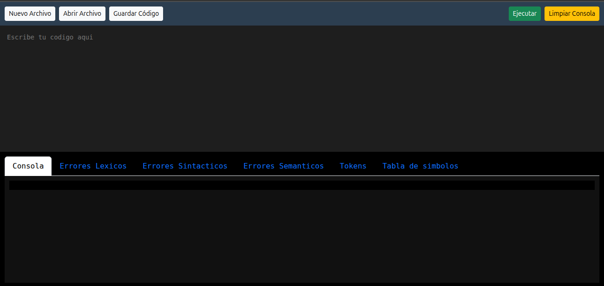

Este es el inicio de nuestra pagina web

## Partes de la pagina

### Cinta de opciones

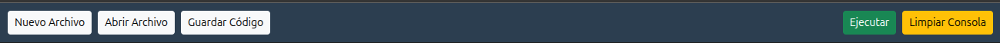

### Editor de texto

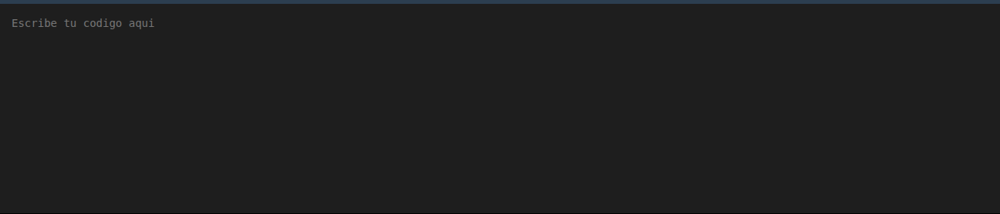

Aqui escribiremos nuestro codigo a interpretar

### Consola

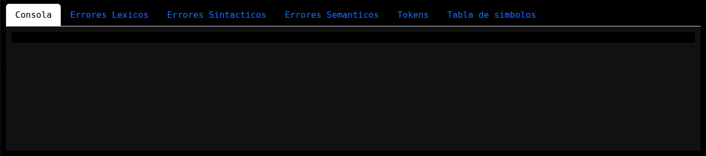

Aqui se mostrara el resultado de la ejecucion de nuestro codigo, cuenta con varias pestañas en las cuales se muestra informacion de importancia

## Funciones Varias

Se encunetran en la parte superior, en la cinta de opciones y contamos con las siguientes funciones

+ Nuevo Archivo: al hacer click en esete boton se nos permitira abrir un nuevo archivo, o sea borrar todo el contenido tanto en el editor como en consola.

+ Abrir Archivo: se nos abrira un cuadro el cual nos dara la opcion de elegir un archivo con extension .txt, el cual contiene codigo a ejecutar.

+ Guardar Codigo: se descargara un archivo .txt el cual contiene el contenido que haya en nuestro editor de texto.

+ Limpiar Consola: unicamente limpia la consola para una nueva ejecucion del mismo codigo.

+ Ejecutar: con este se interpretara nuestro codigo y se mostrara el resultado en consola.

## FUNCIONAMIENTO

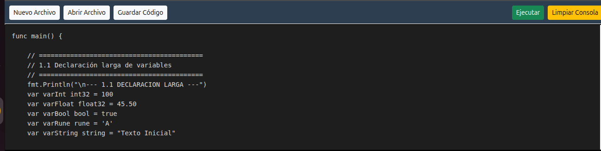

Primeramente escribimos nuestro codigo en el editor de texto y posterior a esto le daremos al boton de ejecutar, tras hacer esto obtendremos la siguiente informacion:

 + Consola: Aqui se muestra el resultado de la ejecucion:

 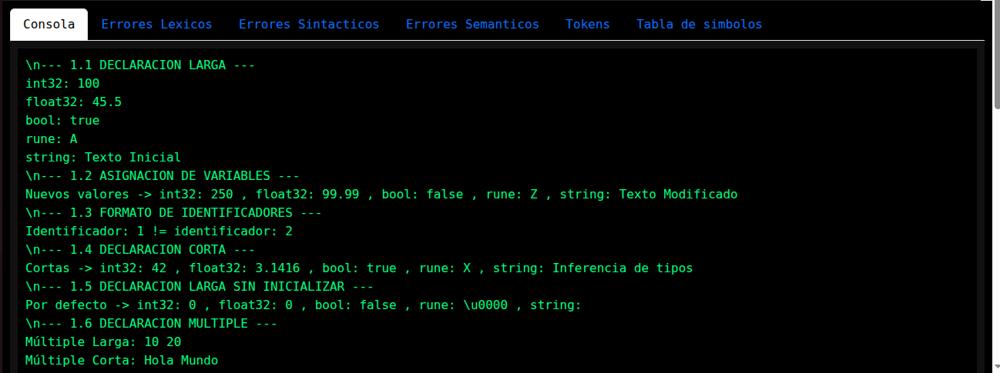

 + Errores Lexicos: Aqui se muestran los errores lexicos que se encontraron en el codigo, es decir caracteres que no reconoce el sistema, muestra informacion como, la cadena no reconocida, la linea y la columna en que se encuentra:

 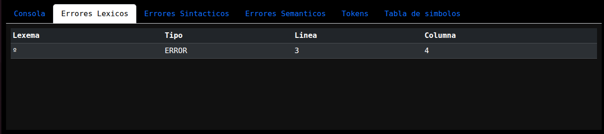

 + Errores Sintacticos: Aqui se muestran los errores sintacticos es decir cuando hay una estructura mal escrita, observamos informacion como la cadena de texto incorrecta,linea y columna donde se encuentra y cual es la cadena de texto que se esperaba:

 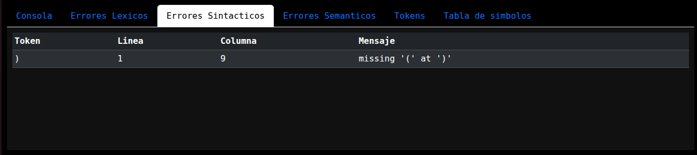

 + Errores Semanticos: Aqui observamos los errores semanticos y obtenemos informacion sobre por que suceden y en que linea y columna se encuentran:

 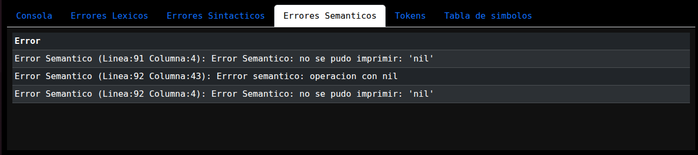

 + Tokens: Aqui observaremos todos los tokens reconocidos en el codigo atravez del analis lexico realizado, obteniendo informacion, como el lexema, el tipo y en que linea y columna se encuentran:

 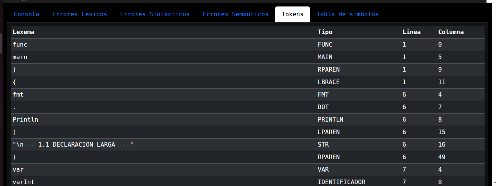

 + Tabla de simbolos: Aqui observaremos todas las variables definidas en nuestro codigo asi como las funciones declaradas, obteniendo informacion como el nombre, el valor, el tipo, los parametros, el retorno en caso de funciones asi como la linea, columna y ambito en el que se encuentran:

 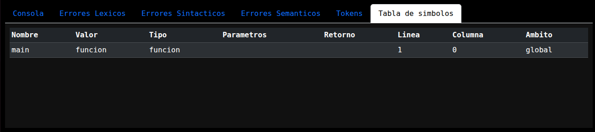